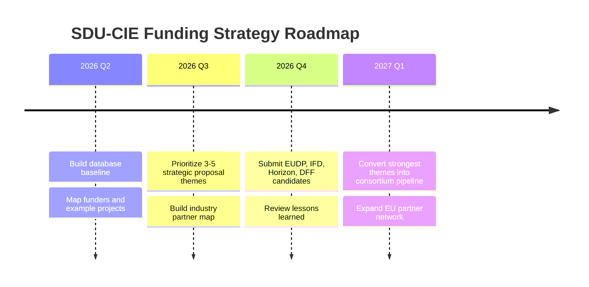
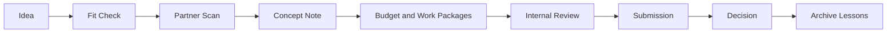

# SDU-CIE Funding Intelligence Database


A GitHub-ready knowledge base for tracking Danish and EU research funding opportunities relevant to SDU-CIE engineering research areas.

This repository is designed for continuous use by a university research group: lightweight enough to maintain manually, structured enough to search, filter, and expand over time.

> **Scope note:** Dates and call details change. Treat entries as strategic intelligence and verify every deadline on the official call page before applying.

## Table of Contents

- [Dashboard](#dashboard)
- [How to Use](#how-to-use)
- [Repository Map](#repository-map)
- [Recent Evidence Window](#recent-evidence-window)
- [Funding Categories](#funding-categories)
- [Filtering Strategy](#filtering-strategy)
- [Recommended Workflow](#recommended-workflow)
- [Roadmap](#roadmap)
- [Proposal Pipeline](#proposal-pipeline)
- [Update Rhythm](#update-rhythm)

## Dashboard

| View | Purpose | Best For |
| ---- | ------- | -------- |
| [Funding Calendar 2026](funding-calendar-2026.md) | Yearly scan of likely deadlines | Monthly planning |
| [Recent Funded Projects and Activities](recent-funded-projects-and-activities.md) | Rolling 3-year evidence base of relevant projects and activities | Proposal positioning and partner intelligence |
| [Large Strategic Grants](large-strategic-grants.md) | High-value, consortium-scale grants | Group strategy and PI pipeline |
| [Small and Medium Grants](small-medium-grants.md) | Seed, feasibility, and early-stage grants | Fast proposal development |
| [Conference and Travel Support](conference-travel-support.md) | Mobility, conferences, visiting stays | PhD, postdoc, and network building |
| [Equipment and Infrastructure](equipment-infrastructure.md) | Equipment, labs, test platforms | Research capability building |
| [Industrial and Commercialization](industrial-commercialization.md) | Industry projects, spinouts, pilots | TRL uplift and partner engagement |

## How to Use

1. Start with [Funding Calendar 2026](funding-calendar-2026.md) to identify the next decision points.
2. Use the category pages to shortlist opportunities by grant size, TRL, and partner requirements.
3. Check [Recent Funded Projects and Activities](recent-funded-projects-and-activities.md) for evidence, partner patterns, and current positioning.
4. Open funder profiles in [foundations/](foundations/) for notes, fit logic, and source links.
5. Track candidate proposals with [Project Tracking Template](templates/project-tracking-template.md).
6. Capture early concepts with [Proposal Ideas Template](templates/proposal-ideas-template.md).
7. Add new funding entries using [Funding Entry Template](templates/funding-entry-template.md).

## Repository Map

| Area | Files |
| ---- | ----- |
| Core views | [Calendar](funding-calendar-2026.md), [Recent Projects and Activities](recent-funded-projects-and-activities.md), [Large Grants](large-strategic-grants.md), [Small Grants](small-medium-grants.md), [Travel](conference-travel-support.md), [Equipment](equipment-infrastructure.md), [Commercialization](industrial-commercialization.md) |
| Funder profiles | [Innovation Fund Denmark](foundations/innovation-fund-denmark.md), [EUDP](foundations/eudp.md), [DFF](foundations/dff.md), [Energy Cluster Denmark](foundations/energy-cluster-denmark.md), [Horizon Europe](foundations/horizon-europe.md), [Chips JU](foundations/chips-ju.md) |
| University intelligence | [AAU](universities/aau-funded-projects.md), [DTU](universities/dtu-funded-projects.md), [AU](universities/au-funded-projects.md), [SDU](universities/sdu-funded-projects.md) |
| Templates | [Funding Entry](templates/funding-entry-template.md), [Project Tracking](templates/project-tracking-template.md), [Proposal Ideas](templates/proposal-ideas-template.md) |

## Recent Evidence Window

Maintain a rolling **3-year list of relevant funded projects and activities** in [Recent Funded Projects and Activities](recent-funded-projects-and-activities.md).

Current window: `2024-2026`.

Include active or recently announced examples from SDU, AAU, DTU, AU, Danish foundations, EU programmes, clusters, and strategic industry partners when they help answer one of these questions:

- Which funders are paying for themes close to SDU-CIE right now?
- Which universities or companies are active in batteries, converters, AI-energy, semiconductors, or maritime electrification?
- Which project framings can be reused in new proposals?
- Which partners should CIE approach before the next call?

## Funding Categories

<details>
<summary><strong>Research Areas Tracked</strong></summary>

- Batteries
- BESS
- EMS/BMS
- Power electronics
- Converters
- Semiconductors
- AI for energy systems
- Acoustics
- Smart energy systems
- Cybersecurity for energy infrastructure
- Maritime electrification
- Advanced manufacturing

</details>

<details>
<summary><strong>Standardized Values</strong></summary>

Career levels: `MSc`, `PhD`, `Postdoc`, `Assistant Professor`, `Associate Professor`, `Professor`, `Research Group`, `University + Industry`, `Startup / SME`

Types: `Conference / Travel`, `Networking`, `Equipment`, `Pilot / Feasibility`, `Innovation`, `Commercialization`, `Industrial Collaboration`, `Fundamental Research`, `Demonstration`, `Education`, `Research Infrastructure`, `Mobility`, `Recruitment`, `Startup / Spinout`

Difficulty: `Low`, `Medium`, `High`, `Very High`

Strategic fit: `Very High`, `High`, `Medium`, `Opportunistic`

</details>

## Filtering Strategy

Use consistent tags in the `Notes` field:

| Tag | Meaning |
| --- | ------- |
| `#battery` | Battery materials, systems, safety, lifetime, second life |
| `#bess` | Grid-scale or containerized battery energy storage systems |
| `#ems-bms` | Energy management systems and battery management systems |
| `#power-electronics` | Converters, drives, EMC, reliability, packaging |
| `#semiconductors` | SiC, GaN, chips, devices, packaging, pilot lines |
| `#ai-energy` | AI, digital twins, forecasting, optimization for energy |
| `#acoustics` | Acoustics, psychoacoustics, sound and hearing-related engineering |
| `#cyber-energy` | Cybersecurity for grids, energy infrastructure, OT systems |
| `#maritime` | Electric ships, ports, maritime batteries, microgrids |
| `#manufacturing` | Advanced production, additive manufacturing, scale-up |

Recommended GitHub searches:

```text
"Very High" "#battery" "University + Industry"
"Deadline" "2026" "#semiconductors"
"EUDP" "#maritime"
"DFF" "#power-electronics"
```

## Recommended Workflow

| Cadence | Action | Owner |
| ------- | ------ | ----- |
| Weekly | Scan open calls and update deadlines | Research support |
| Monthly | Review pipeline and assign proposal owners | CIE leadership |
| Quarterly | Refresh strategic fit and partner needs | Theme leads |
| Before each deadline | Verify eligibility, budget rules, and templates | Proposal owner |
| After decisions | Add funded and rejected proposals as learning cases | Proposal owner |

## Roadmap



## Proposal Pipeline



## Update Rhythm

| Page Type | Update Frequency | Notes |
| --------- | ---------------- | ----- |
| Calendar | Monthly | Move closed calls to notes; add next round when announced |
| Funder pages | Quarterly | Refresh programme names, budgets, and eligibility |
| Recent projects and activities | Quarterly | Maintain a rolling 3-year window; keep active older projects only if strategically relevant |
| University project pages | Twice per year | Add newly funded projects and partner patterns |
| Templates | Annually | Keep standardized categories stable |

## Maintenance Rules

- Use relative links only.
- Keep one opportunity per table row.
- Put uncertain dates as `TBA` or `Verify`.
- Put strategic interpretation in `Notes`, not in the funder name.
- Keep the standardized table schema unchanged across all funding pages.
- Add sources in the `Link` column.
